# Support of SQL read requests for global tables


# New distribution variant Global

Scans of global tables will produce `Distribution::Global`,
conflict resolution is described below in the document.


# Distributions and their invariants
Distribution is a set of properties that must hold for output table
of operator after the subtree with this operator was dispatched to 
storages and materialized.


If Relational operator has distribution:

1. **Any** - output table of relational operator is located on several
storages (may be zero or one). The exact location is determined during bucket discovery.

```sql
select b from segment_a where a = 1
```

Here `segment_a` - is sharded by `a`, `a = 1` guarantees that
we execute the subtree on a single node.

2. **Segment(key)** - the same as **Any**, but the data is spread as if output
table is sharded by **key**.

3. **Single** - the subtree with root in this operator will be executed
on a Single node (and it must be executed on a single node). Therefore
the output table will be located on a single node.
4. **Global** - if the subtree with root in this operator is executed on
several nodes, on each node we will have the exact same output table. But
during planning stage we don't know on which nodes the subtree will be executed,
it will be known only after `bucket_discovery`.
Example: `Values` if you execute wherever we execute this operator, it will
return the same table (because this table is serialized inside `Plan`).


# New buckets variant Any

Let's introduce new buckets variant: `Buckets::Any`. If subtree's root has
`Buckets::Any`, then the subtree must be executed on some arbitrary single node.


# Noteable changes

* Default bucket variant for expression not referencing any table - `Buckets::Any`.
* If expression references segment table, then it is `Buckets::All`
* `Motion(full)` will have `Distribution::Global`, as well as `Values`
* From now on `Motion(full)` will give `Buckets::Any` during `bucket_discovery`,
because it now has `Distribution::Global` or `Distribution::Single`.
* We will drop `Buckets::Single` in favor of `Buckets::Any`.
* Scans of global tables give `Buckets::Any`.
* `Buckets::Any` - the weakest buckets variant, he gives up to all
other buckets variant in disjunction/conjuction.

Example:
```
select * from t1 join t2 on t1.a = t2.b and t2.b = 1
t2: Global
t1: Segment(a)
```
Bucket discovery:

```
projection *                        Buckets::Filtered(a = 1)
    inner join                      Buckets::Filtered(a = 1)*
	scan t1                     Buckets::All
        scan t2                     Buckets::Any
	on t1.a = t2.b and t1.a = 1 Buckets::Filtered(a = 1)

*( Buckets::All || Buckets::Any ) && Buckets::Filtered(a = 1) = Buckets::Filtered(a = 1)
```

### disjunction
```
Buckets::Any || Filtered / All -> Filtered/All
```


### conjuction

```
Buckets::Any && Filtered / All -> Filtered/All
```


# Conflict resolution rules


## Inner Join

### Global vs Global

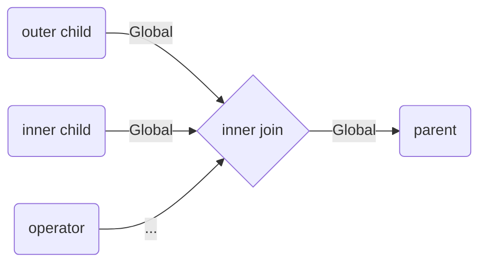

#### 1.

```sql
select * from global1 as g1
inner join
global2 as g2
on true
```

```
Proj * -> Global, Buckets::Any

    Inner Join -> Global, Buckets::Any

        scan global1 -> Global, Buckets::Any

        scan global2 -> Global, Buckets::Any

        on true -> Buckets::Any
```


### Global vs Single


#### 2.
```sql
select * from global as g
inner join
(select avg(b) from t) as t
on t.col1 = g.a
```

```
Proj * -> Single, Buckets::Any

    Inner Join -> Single, Buckets::Any

        scan global -> Global, Buckets::Any

        proj sum/count -> Single, Buckets::Any

            Motion(Full) -> Buckets::Any

                Proj sum, count

                    Scan t

        on t.col1 = g.a -> Buckets::Any
```
### Global vs Segment | Segment vs Global

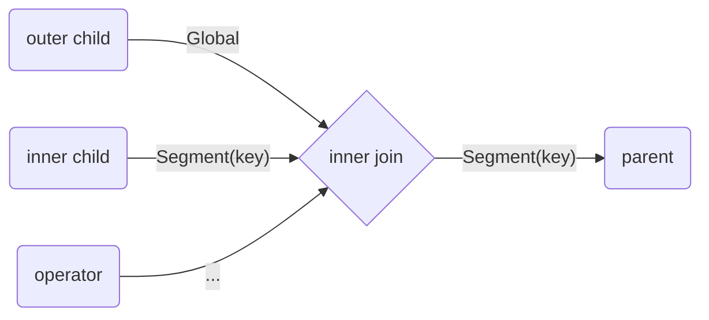

#### 3.

```sql
select * from global as g
inner join
segment as s
on s.a = g.a
```

```
Proj * -> Segment(s.a), Buckets::All

    Inner join -> Segment(s.a), Buckets::All

        scan global -> Global, Buckets::Any

        scan segment -> Segment(a), Buckets::All

        on s.a = g.a -> Buckets::All
```

_Note: `on s.a = g.a` gives `Buckets::All` because this expression refers to
sharded table_.


#### 4.

```sql
select * from global as g
inner join
segment as s
on s.a = g.a and s.a = 1

s(a)
```

```
Proj * -> Segment(a), Buckets::Filtered(s.a = 1)

    Inner join -> Segment(a), Buckets::Filtered(s.a = 1)

        scan global -> Global, Buckets::Any

        scan segment -> Segment(a), Buckets::All

        on s.a = g.a and s.a = 1 -> Buckets::Filtered(s.a = 1)
```

#### 6.
```sql
select * from global2 as g
inner join
(select * from segment
inner join global1 on true) as s
on s.a = g.a and s.a = 1
```

```
Proj * -> Any, Buckets::All

    Inner join -> Segment, Buckets::All

        scan global2 -> Global, Buckets::Any

        Projection -> Segment, Buckets::All

            Inner Join -> Segment, Buckets::All

			…

        on s.a = g.a and s.a = 1 -> Buckets::Any
```

### Global vs Any | Any vs Global

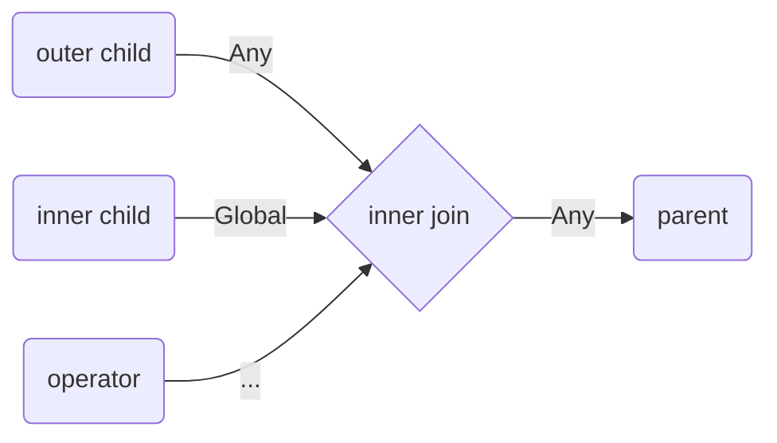

#### 5.

```sql
select * from global as g
inner join
(select 1 from segment) as s
on s.a = g.a and s.a = 1
```

```
Proj * -> Any, Buckets::All

    Inner join -> Any, Buckets::All

        scan global -> Global, Buckets::Any

        Projection 1 -> Any, Buckets::All

            Scan -> Segment, Buckets::All

        on s.a = g.a and s.a = 1 -> Buckets::Any
```


## Left Join


### global vs segment/any

Do inner join and then add remaining rows from the global table on the router.
To avoid using extra space, we will sort the result table on left table columns
and then use binsearch to find tuple.

In our case map stage is doing inner join on each node. However the difference
is that reduce stage is done via router (not local sql). We do this router
reduce stage via motion opcodes. We will have two additional opcodes: sort - to
sort table from map stage, left_join_append(global table) - to append missing
rows from global table.


Implementation details: during conflict resolution if we see left join with
children that have global and segment distribution respectively, we do a
transformation that splits plan into 2 stages: inner join on all nodes (map)
and adding missing rows from left table (reduce). In map stage, in projection
only the columns needed for above operators must be used, so that we transfer
less data through the wire.


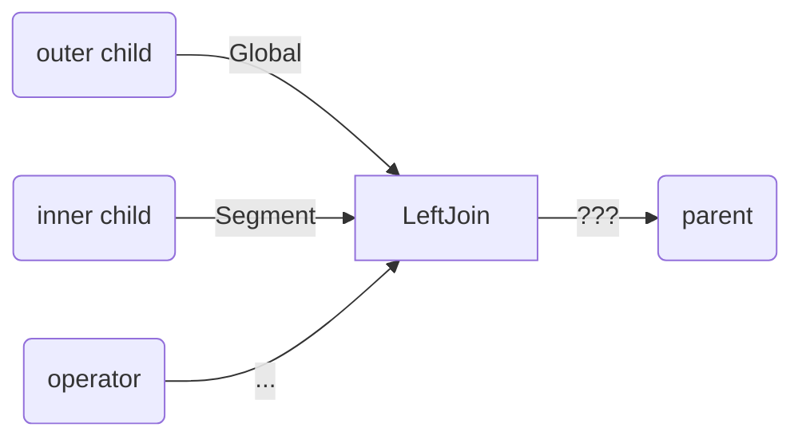
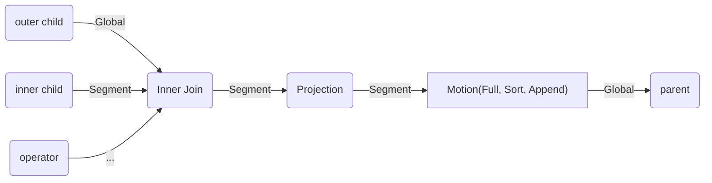

#### 7. global vs segment

```sql
select * from global as g
left join segment as s
on g.a = s.a
```

Plan before resolving conflicts:

```
projection *
	left join
		scan global
        scan segment
		on g.a = s.a
```

After conflict resolution:

```
projection * -> Single, Buckets::Any

    Motion(Full, sort, left_join_append(global_table)) -> Single, Buckets::Any

    	Projection * -> Segment, Buckets::All

            inner join -> Segment, Buckets::All

                scan global -> Global, Buckets::Any

                scan segment -> Segment, Buckets::All

                on g.a = s.a -> Buckets::All
```


#### 7.1 Unfinished left join with group by

Suppose _global_ has columns a, b. _Segment_ has columns a, c. In projection below motion we should try to minimize the number of columns to send through the wire. We always need all columns from left table, but from right table we only need columns that are used higher in the plan.

```sql
select g.a, s.a from global as g
left join segment as s
on g.a < s.a
group by g.a, s.a
```
```

projection g.a, s.a → Single, Buckets::Any


    GroupBy g.a, s.a → Single, Buckets::Any


        Motion(Full, Sort, left_join_append(global)) → Single, Buckets::Any


            projection g.a, g.b, s.a → Segment, Buckets::All


                inner join → Segment, Buckets::All

                    scan global → Global, Buckets::Any


                    scan segment → Segment, Buckets::All

                    on g.a < s.a → Buckets::All
```

### global vs single

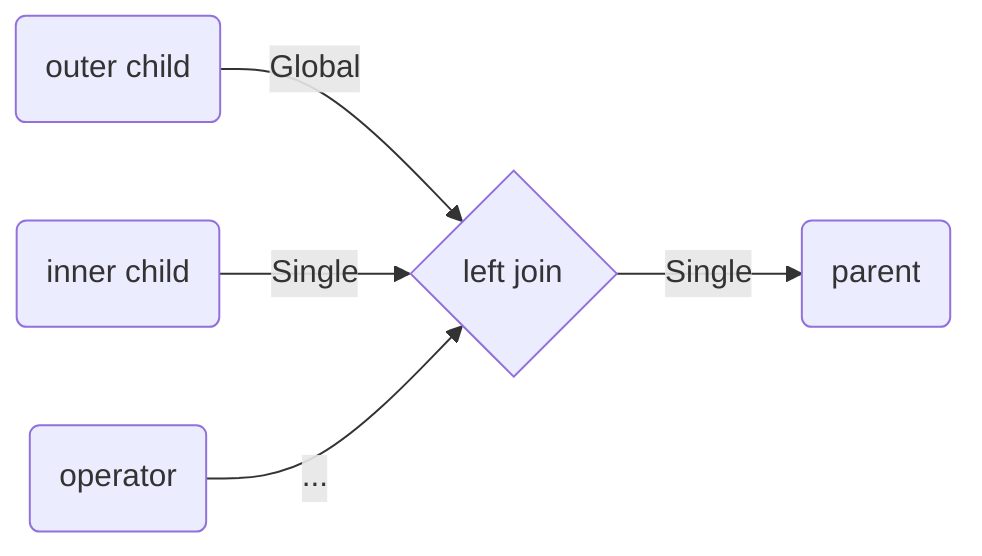

We don’t need motion, because right child is already on the router.


#### 8.
```sql
select * from global as g
left join (select sum(u) from t2)
on ...
```
```
projection * Single, Buckets::Any

    left join -> Single, Buckets::Any

        projection -> Global, Buckets::Any

            scan global -> Global, Buckets::Any

        projection sum(sum) -> Single, Buckets::Any

            Motion(Full) -> Global, Buckets::Any
```

#### 10.
```sql
select * from global
left join (select a from global_t2 union all select b from global_t2)
on ...
```
```
projection -> Global, Buckets::Any

    left join -> Global, Buckets::Any

        proj -> Global, Buckets::Any

            scan global

        union all  -> Global, Buckets::Any

            ...

        cond → Buckets::Any (all refs would be referring to global tables)
```

### global vs global


### segment/any vs global

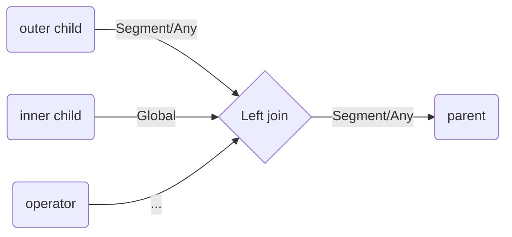

#### 11.
```sql
select * from segment
left join global
on ... // does not matter what kind of condition is used
```

```
projection * → Segment, Buckets::All

    left join -> Segment, Buckets::All

        projection -> Segment, Buckets::All

            scan segment

        projection  -> Global, Buckets::Any

            scan global

        condition: …
```


## UnionAll


### global vs global -> global

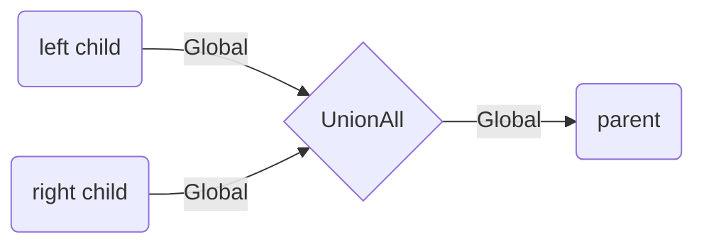

### global vs single -> single

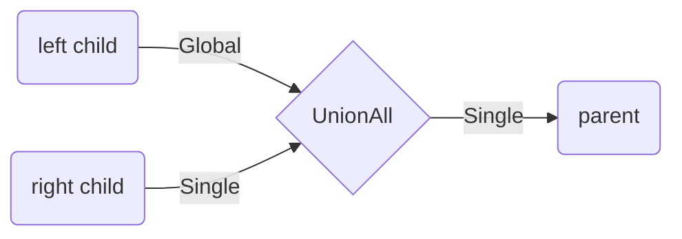

The same for `single vs global`.


### global vs any/segment -> any

We can't do union all on all nodes, because we will get duplicate results.

Solution: add where filter on primary key for global table scan. Before sending query to the storages parametrize the condition by primary key values for different storages.

Implementation details: currently our executor does not parametrize queries in any way, so I think we will need to save some context information on planning stage: what plan nodes must be parametrized and how.

initial query:

```sql
select * from global
union all
select * from segment
```

new query:

```sql
select * from global
where pk between ? and ?
union all
select * from segment
```

Suppose we know, that the query must be executed on two replicasets, then:

we will scan `global` on the router, and find the primary key value that splits table by half.
Suppose it is a1, the first value of the key is a0, and the last value is a2.

replicaset 1:

```sql
select * from global
where pk between a0 and a1
union all
select * from segment
```

replicaset 2:

```sql
select * from global
where pk between a1 and a2
union all
select * from segment
```

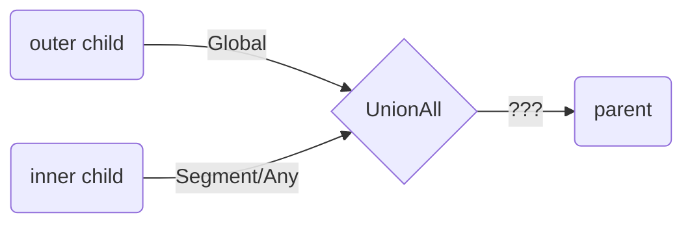
->
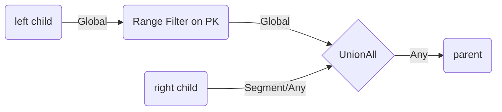


## Except


### segment/any vs global -> segment/any

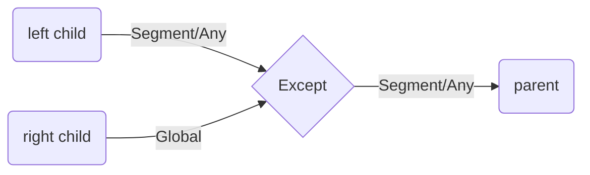


### single vs global / global vs single -> single,

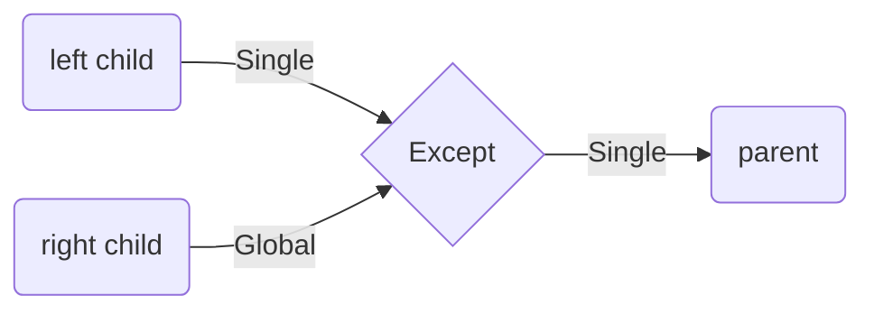

### global vs global -> global

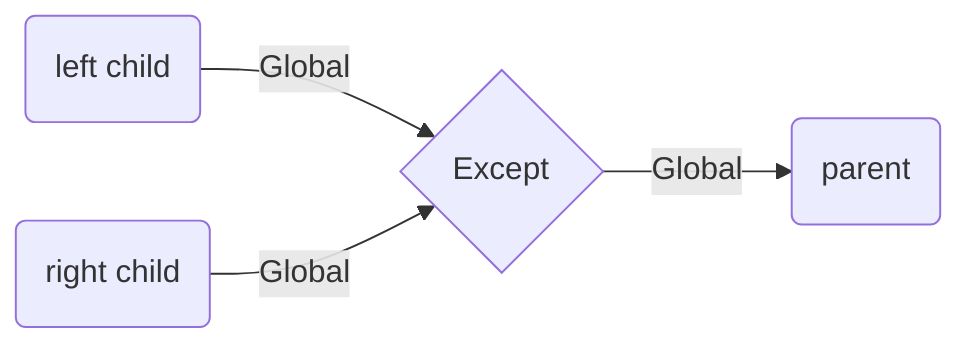


### global vs segment

Calculate the bucket id for global table rows and create the temporary table
that will hold only those rows that belong to current storage. Use that table
instead of original global table in the query.


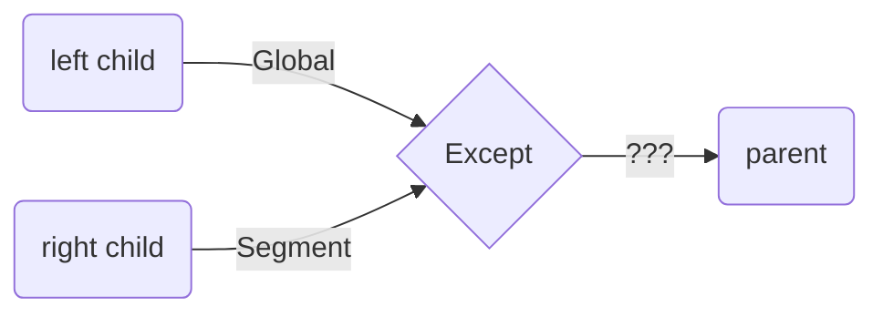
->
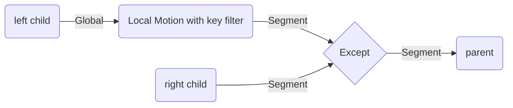
#### 13.

```sql
select b from global
except
select a from segment
```

```
except → Segment(0), Buckets::All

    local motion (Segment(b), filter by key) -> Segment(b), Buckets::Any

        projection b -> Global, Buckets::Any

            scan global -> Global, Buckets::Any

    projection a -> Segment(a), Buckets::All

        scan segment -> Segment(a), Buckets::All
```

We use the same execution logic as on router, traverse tree motion by motion from bottom to the top.


### global vs any

Solution:

* map stage: do intersect of global table and part of the other table
* reduce stage: do except for global table and concatenated parts from map stage

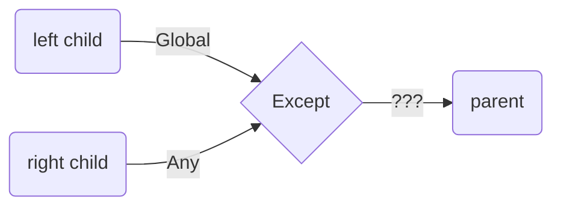
->
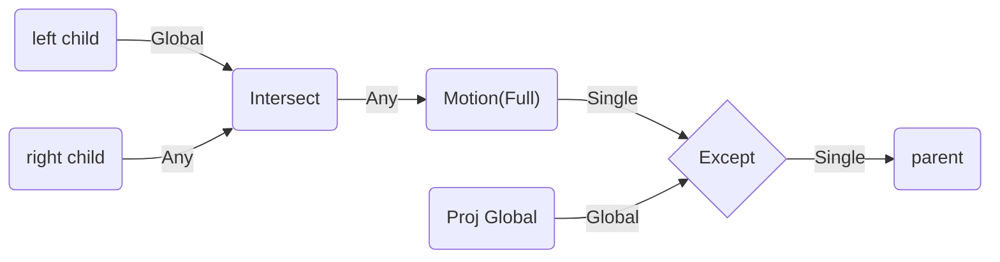

#### 14.

```sql
select b from global
except
select a from segment
```

```
except -> ?
projection b -> Global
		scan global -> Global
	projection a -> Any
		scan segment -> Segment
```

Transforms into this:

```
Except -> Single, Buckets::Any

    projection b -> Global, Buckets::Any

        scan global -> Global, Buckets::Any

    Motion(Full) -> Single, Buckets::Any

        intersect -> Any, Buckets::All

            projection b -> Global, Buckets::Any

                scan global -> Global, Buckets::Any

            projection a -> Any, Buckets::All

                scan segment -> Segment, Buckets::All
```


Note: alternative approach is to reshard right child on some column (a), then
use approach from _global_ vs _segment_.


## Subquery referencing global tables

In this case we don't need any motions, because global table is present on each
node it is equivalent to doing Motion::Full, but here we actually don't need to
move the data.


```mermaid
flowchart LR
    Sel{Selection}
    sq(SubQuery)
    Child(child) --> |Segment/Any| Sel
    sq --> |Global| Sel
    Sel --> |Segment/Any| Parent(parent)
```

#### 16.

```
select a from segment
where a in (select b from global_t)
```

```
projection -> Segment, Buckets::All

    selection -> Segment, Buckets::All

        ScanSQ -> Global, Buckets::Any

            Projection b -> Global, Buckets::Any

                Scan global_t -> Global, Buckets::Any

        condition: a in SQ -> Buckets::Any

        scan segment -> Segment, Buckets::All
```

#### 17.

A more complex query with global tables like
join/union/except/groupby/aggregates will produce distribution Any/Global,
which in turn will require some data motion for subquery:

```sql
select a from t // t has segment distribution
where a in (
select b from global_t
union all
select d from segment)
```

Example with bucket discovery for query above, assuming t has segment distribution on a.

```
Projection -> Buckets::Filtered(Y)

    Selection -> Segment(a), Buckets::Filtered(Y)

        Scan t -> Segment(a), Buckets::All

$1
        Motion::Segment(a) -> Segment(a), Buckets::Filtered(Y) ←

            ScanSQ -> Any, Buckets::All

                UnionAll -> Any, Buckets::All

             				 …

        condition: a in $1 -> Buckets::Filtered(Y)
```


## Subquery referencing non-global table with query against global table

In this case selection/join child has global distribution and subquery is present in the filter/condition. For example:

```sql
select a from global
where a in (select sum(a) from t)
select * from global
inner join seg
on global_t.a in (select ...) and seg.a = global_t.b
```

Let's consider different cases for various subquery distributions.


### SQ with single distribution

In this case we simply do reduce stage of the aggregation on the local node:

```mermaid
flowchart LR
    Sel{Selection}
    sq(SubQuery)
    Child(child) --> |Global| Sel
    sq --> |Single| Sel
    Sel --> |Single| Parent(parent)
```
#### 18.

```sql
select * from global
where global.u in
(select count(x) from t)
```

```
projection -> Single, Buckets::Any

    selection -> Single, Buckets::Any (= Buckets::Any && Buckets::Any)

        scan global_t -> Global, Buckets::Any

$1
        ScanSubQuery  -> Single, Buckets::Any

            projection sum(c) -> Single, Buckets::Any

                motion(full) -> Single, Buckets::Any

                    proj count as c

                        scan t

        filter: u in $1 -> Buckets::Any
```


### SQ with Segment distribution

Here we can execute on all nodes! Because segment distribution has a nice property:
all rows that have the same value of shard key lie on the same node.

This works only for condition like this: `column in/= SQ`

But for arbitrary conditions like this: `column < SQ, we will have to insert a Motion(Full).`

```mermaid
flowchart LR
    Sel{Selection with =/in}
    sq(SubQuery)
    Child(child) --> |Global| Sel
    sq --> |Segment| Sel
    Sel --> |Segment| Parent(parent)
```

```mermaid
flowchart LR
    motion(motion full)
    Sel{Selection with arbitrary op}
    sq(SubQuery)
    sq --> |Segment| motion
    Child(child) --> |Global| Sel
    motion --> |Global| Sel
    Sel --> |Global| Parent(parent)
```

#### 20.

For example:

t: segment(a)
```
select * from global
where c, b in (select a, b from t)
```

```
projection Segment(c) Buckets::All

    selection → Segment(c) Buckets::All

        Scan global → Global, Buckets::Any

$1:
        ScanSQ → Segment(a) Buckets::All

            projection a, b → Segment(a) Buckets::All

                scan t → Segment(a) Buckets::All

        condition: a, b in $1 → Buckets::All

```
<table>
  <tr>
   <td>
   </td>
   <td>storage 1
   </td>
   <td>storage 2
   </td>
  </tr>
  <tr>
   <td>global table contents
   </td>
   <td>[1, 1], [2, 3], [3, 3]
   </td>
   <td>[1, 1], [2, 3], [3, 3]
   </td>
  </tr>
  <tr>
   <td>subquery table local contents
   </td>
   <td>[1, 1], [2, 1]
   </td>
   <td>[3, 1], [4, 1]
   </td>
  </tr>
  <tr>
   <td>local query results
   </td>
   <td>[1, 1]
   </td>
   <td>[]
   </td>
  </tr>
</table>

Can we execute such query without motions?

```sql
select a, b from global
where a in (select b from segment_b) or b in (select c from segment_c)
```

No, for example:

```
global (a int, b decimal): [1, 100]
segment_b (b int): [1]
segment_c (c decimal): [100]

node1:
segment_b: [1]
segment_c: []

node2:
segment_b: []
segment_c: [100]
```

Then: we have `[1, 100]` twice in result table.


On the other hand, if subqueries are and-ed, then we can execute such query.

Therefore, we must check: if at least two and-chains contain subquery with segment distribution,
we must add `Motion(Full)` for each such subquery.


select a, b from globals
where a in (select b from segment_b) or a in (select c from segment_c)


### SQ with ANY distribution

Here we can’t be sure that the same value is located on the same replicaset.

Actually, we have to add motion for subquery and because our executor can’t
move between segments (only through motion) we will have to execute the query
on the router.

```mermaid
flowchart LR
    motion(motion full)
    Sel{Selection}
    sq(SubQuery)
    sq --> |Any| motion
    Child(child) --> |Global| Sel
    motion --> |Global| Sel
    Sel --> |Global| Parent(parent)
```


#### 21

```
select * from global
where a, b in (select c + 2, d * d from segment)
```

```
projection → Single, Buckets::Filtered

    selection → Single, Buckets::Filtered

        scan global → Global, Buckets::Any

$1:
        Motion(Full) → Global, Buckets::Any

            ScanSQ → Any, Buckets::All

                projection c + 2, d*d → Any, Buckets::All

                    scan segment → Segment, Buckets::All

        condition a, b in $1 → Buckets::Any
```


## GroupBy && aggregates on global tables

If projection has aggregates and/or we have GroupBy/Having node and child
distribution under Projection(if no GroupBy/Having), GroupBy/Having node has
distribution Global then we don’t need 2-stage transformation for that. Instead
we can execute it in one stage.


```mermaid
flowchart LR
    Child(child) --> |Global| GroupBy
    GroupBy --> |Global| Parent(parent)
```

#### 22

```sql
select avg(c) from global
```
```
projection avg(c) → Global Buckets::Any

	scan global → Global Buckets::Any
```

#### 23
```sql
select avg(c) from global where global.u in (select count(x) from t)
```

```
projection avg(c) -> Single, Buckets::Any

selection -> Single, Buckets::Any

    		Scan global_t -> Global, Buckets::Any

$1:
    		ScanSubQuery  -> Single, Buckets::Any

      			projection sum(c) -> Single, Buckets::Any

        			motion(full) -> Single, Buckets::Any

            				proj count as c

              					scan t

    		filter: u in $1 -> Buckets::Any
```
